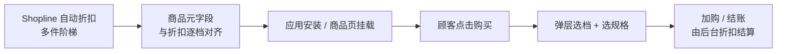

# 自定义购买选择器（product-variant-picker2）

::: info 适用范围
**Shopline 应用插件** · 脚本：`product-variant-picker2` · 仓库：shopline-app-script
:::

**适合做什么：** 在商品详情页弹出「组合购买」面板：顾客先选优惠档位（如 2 件 / 3 件），再为每一档分别选规格，最后加入购物车或立即结账。

> 与主题自带的「规格选择器」不同：本插件是**独立脚本 + 弹层 UI**。  
> **实际减价靠 Shopline 后台折扣；弹层文案与预估价靠商品元字段——两套配置必须一致。**


## 必读：须配合 Shopline 折扣，并与元字段一致

本插件分两层职责：

| 配置位置 | 管什么 | 不管什么 |
|----------|--------|----------|
| **Shopline 营销 → 折扣**（自动折扣 / 多件阶梯） | 购物车、结账时**真正生效**的件数门槛与减免 | 弹层上的标题、角标文案 |
| **商品元字段**（见下文 5 个键） | 弹层里各档**标题、角标、展示的折后价** | 结账是否减价（减价仍由后台折扣决定） |

::: warning 只填元字段、不建后台折扣时
弹层可能显示「优惠价」，但加购后购物车/结账**不会自动减价**。运营与实施务必**先配 Shopline 折扣，再按同一套规则填元字段**（团队若用「折扣同步」对照表，也以 Shopline 已发布折扣为准）。
:::

### 整体流程（运营视角）



1. 在 **Shopline 后台** 为该商品创建**多件阶梯自动折扣**（见下一节）。
2. 在**同一商品**的元字段里，按**相同档位数、相同件数、相同折扣力度**填写 5 个键。
3. 技术 / 实施确保应用脚本已安装，商品详情页有挂载点。
4. 顾客点击购买 → 弹层读元字段展示 → 加购后由 Shopline 折扣在购物车/结账生效。

---

## Shopline 后台：配置自动折扣（与元字段同步）

入口一般为：**营销 → 折扣 → 自动折扣**（或店铺里等价的「促销活动 / 自动优惠」）。为本商品创建**按购买件数分档**的活动（同一商品通常只保留**一条**适用的多件活动，避免规则冲突）。

### 每一档在后台怎么填（须与元字段一致）

| Shopline 折扣里（白话） | 对应元字段键 | 对齐要求 |
|-------------------------|--------------|----------|
| 第 N 档：**满 / 买满几件**（购买件数门槛） | `custom_discount_variant_num` 第 N 段 | 数字完全相同，如后台「满 2 件」→ 元字段写 `2` |
| 第 N 档：**优惠方式 = 百分比**（如减 10%） | `discountQuotas` 第 N 段 | 填**整数百分比**，如 10% off → 写 `10`（不是 0.1） |
| 第 N 档：**优惠方式 = 固定金额**（如减 1800 日元） | `fixedDiscountAmounts` 第 N 段 | 填**主货币整数金额**；该档若用百分比，则元字段固定金额段留空 |
| 弹层上顾客看到的**档位标题**（后台可能没有单独字段） | `customDiscountTitle` 第 N 段 | 文案自定，建议与活动说明一致，如 `2足購入で` |
| 弹层**角标**（最划算、推荐等） | `custom_discount_badge_labels` 第 N 段 | 仅影响展示，可与后台无关；可留空 |

### 配置检查清单

- [ ] 折扣**适用商品**包含当前商品（或所在合集），且活动**已启用**、在有效期内。
- [ ] 折扣**档位数** = 元字段逗号分隔的段数（例如都是 3 档）。
- [ ] 每一档的**件数**与 `custom_discount_variant_num` 逐档相同。
- [ ] 每一档用**百分比**还是**固定金额**，与 `discountQuotas` / `fixedDiscountAmounts` 一致（同一商品建议统一用一种方式；插件优先读百分比）。
- [ ] 改折扣后**同步改元字段**，否则弹层价与购物车价不一致。

### 三档示例：后台折扣 ↔ 元字段

假设 Shopline 自动折扣为：

| 档位 | 购买件数 | 优惠 |
|------|----------|------|
| 1 | 满 2 件 | 减 10% |
| 2 | 满 3 件 | 减 15% |
| 3 | 满 4 件 | 减 20% |

元字段应填为：

| 键名 | 值 |
|------|-----|
| `customDiscountTitle` | `2足購入で,3足購入で,4足購入で` |
| `custom_discount_variant_num` | `2,3,4` |
| `custom_discount_badge_labels` | `最划算,お得,` |
| `discountQuotas` | `10,15,20` |
| `fixedDiscountAmounts` | （留空） |

若第 2 档在后台改为「满 3 件减 1800 日元（固定金额）」：后台固定减 1800 → `fixedDiscountAmounts` 第 2 段写 `1800`，且该档 `discountQuotas` 第 2 段留空或写 `0`（插件有百分比时优先用百分比）。

---

## Shopline 后台：商品元字段

在 **设置 → 元字段 → 商品** 中创建以下字段（键名需与下表一致）。所有「多档」字段均用**英文逗号 `,`** 分隔，**档位数必须一致**。

| 键名 | 类型建议 | 必填 | 说明 |
|------|----------|------|------|
| `customDiscountTitle` | 单行文本 | 是 | 各档标题，逗号分隔。例：`2足購入で,3足購入で,4足購入で` |
| `custom_discount_variant_num` | 单行文本 | 是 | 各档需选**几件**（规格数），逗号分隔。例：`2,3,4` |
| `custom_discount_badge_labels` | 单行文本 | 否 | 各档角标文案，逗号分隔。例：`最划算,推荐,` |
| `discountQuotas` | 单行文本 | 否 | 各档**折扣百分比**（整数），须与 Shopline 折扣「减 X%」一致。例：`10,15,20` = 10% / 15% / 20% off |
| `fixedDiscountAmounts` | 单行文本 | 否 | 各档**固定减免金额**（主货币整数），须与 Shopline 折扣「减 X 元」一致。与百分比二选一：该档 `discountQuotas` 有正数时优先按百分比展示 |

### 填写示例（3 档优惠）

在某一商品元字段中填入：

| 键名 | 示例值 |
|------|--------|
| customDiscountTitle | `2足購入で,3足購入で,4足購入で` |
| custom_discount_variant_num | `2,3,4` |
| custom_discount_badge_labels | `最划算,お得,` |
| discountQuotas | `10,15,20` |
| fixedDiscountAmounts | （留空，使用百分比） |

前台效果：三个可折叠档位，分别要选 2 / 3 / 4 件商品规格；选中档显示对应标题、角标和折后价。

::: details 元字段配置 JSON 参考（便于批量导入或对照）

```json
{
  "customDiscountTitle": "2足購入で,3足購入で,4足購入で",
  "custom_discount_variant_num": "2,3,4",
  "custom_discount_badge_labels": "最划算,お得,",
  "discountQuotas": "10,15,20",
  "fixedDiscountAmounts": ""
}
```

:::

### 字段对应关系

| 第 1 档 | 第 2 档 | 第 3 档 | … |
|---------|---------|---------|---|
| customDiscountTitle 第 1 段 | 第 2 段 | 第 3 段 | 逗号从左到右 |
| custom_discount_variant_num 第 1 段 | 第 2 段 | 第 3 段 | 该档需选几件 |
| custom_discount_badge_labels 第 1 段 | 第 2 段 | 第 3 段 | 角标，可留空 |
| discountQuotas 或 fixedDiscountAmounts | 第 2 段 | 第 3 段 | 该档优惠力度 |

## Shopline 应用侧配置（实施参考）

以下内容面向**技术 / 实施**，运营只需知道「应用要装好、商品页要有挂载点」。

| 项目 | 说明 |
|------|------|
| 脚本入口 | `https://shopline-scripts-cdn.qgergdv.com/scripts/product-variant-picker2/main.js` |
| 全局对象 | `window.BundleProductVariantPicker` |
| 创建实例 | `BundleProductVariantPicker.create({ containerBody: 挂载的 DOM 元素, ... })` |
| 就绪回调 | `BundleProductVariantPicker.onReady(function (e) { ... })`，`e.status === 'ready'` 后再调用 `open` |
| 打开面板 | `picker.open(商品ID)`，会拉取商品信息与元字段 |
| 商品识别 | 优先用当前页 URL 中的商品 handle，通过店铺 Ajax 接口取商品数据 |

### 可选样式参数（代码里传入，非元字段）

| 参数 | 作用 | 默认 |
|------|------|------|
| discountActiveColor | 选中档高亮色 | `#ff7800` |
| buyButtonColor | 购买按钮色 | `#ff0000` |
| fontSizePc / fontSizeMobile | 字号 | 16 / 13 |
| hideCart / hideCheckout | 隐藏加购或结账按钮 | false |
| badgeLabels | 也可在代码里写角标（一般改用元字段） | — |

## 顾客侧操作说明

1. 点击商品页上由应用绑定的购买按钮（具体文案由主题 / 应用配置）。
2. 弹出层中选择优惠档位（单选）。
3. 在展开区域为**每一件**选择规格（下拉框带图）。
4. 点击「加入购物车」或「立即结账」。

## 常见疑问

| 现象 | 原因 / 处理 |
|------|------------|
| 点击按钮没反应 | 脚本未加载完；稍等或刷新。技术检查 CDN 与应用是否启用 |
| 弹出层是空的 / 没有档位 | 该商品未配置元字段，或 `customDiscountTitle` / `custom_discount_variant_num` 未填 |
| 只有一档但想三档 | 逗号分隔段数不够；检查五个键的档位数是否对齐 |
| 弹层价对、购物车不减价 | **未配或未启用** Shopline 自动折扣，或件数门槛与元字段不一致；先对后台折扣，再对元字段 |
| 弹层价与购物车价不一致 | 改折扣后未改元字段，或 `discountQuotas` / `fixedDiscountAmounts` 与后台数值不同 |
| 折扣价不对（仅弹层） | 看 `discountQuotas` 是否为整数百分比；固定金额档是否误填了 `fixedDiscountAmounts` |
| 与主题规格区重复 | 正常：主题管单件规格，本插件管「多件组合」弹层；按页面设计保留其一或分工 |

## 相关文档

- [应用插件总览](/apps/)
- 主题内「单件规格」区块：使用主题自带规格选择器，见商品详情模板配置
