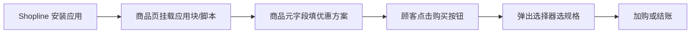

# 自定义购买选择器（product-variant-picker2）

::: info 适用范围
**Shopline 应用插件** · 脚本：`product-variant-picker2` · 仓库：shopline-app-script
:::

**适合做什么：** 在商品详情页弹出「组合购买」面板：顾客先选优惠档位（如 2 件 / 3 件），再为每一档分别选规格，最后加入购物车或立即结账。各档的标题、徽章、折扣力度**按商品**通过元字段配置。

> 与主题自带的「规格选择器」不同：本插件是**独立脚本 + 弹层 UI**，需在 Shopline 后台为每个商品填好元字段后才会显示对应优惠方案。

## 整体流程（运营视角）



1. 技术 / 实施在 Shopline 后台**启用应用**（或按项目约定注入脚本）。
2. 商品详情模板中保留应用提供的**挂载容器**（由实施配置，运营一般不用改代码）。
3. 运营在**每个参与活动的商品**上填写下方元字段。
4. 前台顾客点击触发按钮后，插件读取当前商品元字段并渲染优惠档位。

## Shopline 后台：商品元字段

在 **设置 → 元字段 → 商品** 中创建以下字段（键名需与下表一致）。所有「多档」字段均用**英文逗号 `,`** 分隔，**档位数必须一致**。

| 键名 | 类型建议 | 必填 | 说明 |
|------|----------|------|------|
| `customDiscountTitle` | 单行文本 | 是 | 各档标题，逗号分隔。例：`2足購入で,3足購入で,4足購入で` |
| `custom_discount_variant_num` | 单行文本 | 是 | 各档需选**几件**（规格数），逗号分隔。例：`2,3,4` |
| `custom_discount_badge_labels` | 单行文本 | 否 | 各档角标文案，逗号分隔。例：`最划算,推荐,` |
| `discountQuotas` | 单行文本 | 否 | 各档**折扣百分比**（整数），逗号分隔。例：`10,15,20` 表示 10% / 15% / 20% off |
| `fixedDiscountAmounts` | 单行文本 | 否 | 各档**固定减免金额**（店铺主货币整数，如日元填 `1800` 表示减 1800 日元）。与百分比二选一：有 `discountQuotas` 时优先用百分比 |

### 填写示例（3 档优惠）

在某一商品元字段中填入：

| 键名 | 示例值 |
|------|--------|
| customDiscountTitle | `2足購入で,3足購入で,4足購入で` |
| custom_discount_variant_num | `2,3,4` |
| custom_discount_badge_labels | `最划算,お得,` |
| discountQuotas | `10,15,20` |
| fixedDiscountAmounts | （留空，使用百分比） |

前台效果：三个可折叠档位，分别要选 2 / 3 / 4 件商品规格；选中档显示对应标题、角标和折后价。

::: details 元字段配置 JSON 参考（便于批量导入或对照）

```json
{
  "customDiscountTitle": "2足購入で,3足購入で,4足購入で",
  "custom_discount_variant_num": "2,3,4",
  "custom_discount_badge_labels": "最划算,お得,",
  "discountQuotas": "10,15,20",
  "fixedDiscountAmounts": ""
}
```

:::

### 字段对应关系

| 第 1 档 | 第 2 档 | 第 3 档 | … |
|---------|---------|---------|---|
| customDiscountTitle 第 1 段 | 第 2 段 | 第 3 段 | 逗号从左到右 |
| custom_discount_variant_num 第 1 段 | 第 2 段 | 第 3 段 | 该档需选几件 |
| custom_discount_badge_labels 第 1 段 | 第 2 段 | 第 3 段 | 角标，可留空 |
| discountQuotas 或 fixedDiscountAmounts | 第 2 段 | 第 3 段 | 该档优惠力度 |

## Shopline 应用侧配置（实施参考）

以下内容面向**技术 / 实施**，运营只需知道「应用要装好、商品页要有挂载点」。

| 项目 | 说明 |
|------|------|
| 脚本入口 | `https://shopline-scripts-cdn.qgergdv.com/scripts/product-variant-picker2/main.js` |
| 全局对象 | `window.BundleProductVariantPicker` |
| 创建实例 | `BundleProductVariantPicker.create({ containerBody: 挂载的 DOM 元素, ... })` |
| 就绪回调 | `BundleProductVariantPicker.onReady(function (e) { ... })`，`e.status === 'ready'` 后再调用 `open` |
| 打开面板 | `picker.open(商品ID)`，会拉取商品信息与元字段 |
| 商品识别 | 优先用当前页 URL 中的商品 handle，通过店铺 Ajax 接口取商品数据 |

### 可选样式参数（代码里传入，非元字段）

| 参数 | 作用 | 默认 |
|------|------|------|
| discountActiveColor | 选中档高亮色 | `#ff7800` |
| buyButtonColor | 购买按钮色 | `#ff0000` |
| fontSizePc / fontSizeMobile | 字号 | 16 / 13 |
| hideCart / hideCheckout | 隐藏加购或结账按钮 | false |
| badgeLabels | 也可在代码里写角标（一般改用元字段） | — |

## 顾客侧操作说明

1. 点击商品页上由应用绑定的购买按钮（具体文案由主题 / 应用配置）。
2. 弹出层中选择优惠档位（单选）。
3. 在展开区域为**每一件**选择规格（下拉框带图）。
4. 点击「加入购物车」或「立即结账」。

## 常见疑问

| 现象 | 原因 / 处理 |
|------|------------|
| 点击按钮没反应 | 脚本未加载完；稍等或刷新。技术检查 CDN 与应用是否启用 |
| 弹出层是空的 / 没有档位 | 该商品未配置元字段，或 `customDiscountTitle` / `custom_discount_variant_num` 未填 |
| 只有一档但想三档 | 逗号分隔段数不够；检查五个键的档位数是否对齐 |
| 折扣价不对 | 优先看 `discountQuotas`；若填了百分比仍不对，检查是否误填 `fixedDiscountAmounts` |
| 与主题规格区重复 | 正常：主题管单件规格，本插件管「多件组合」弹层；按页面设计保留其一或分工 |

## 相关文档

- [应用插件总览](/apps/)
- 主题内「单件规格」区块：使用主题自带规格选择器，见商品详情模板配置
